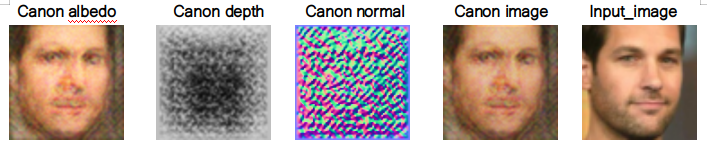
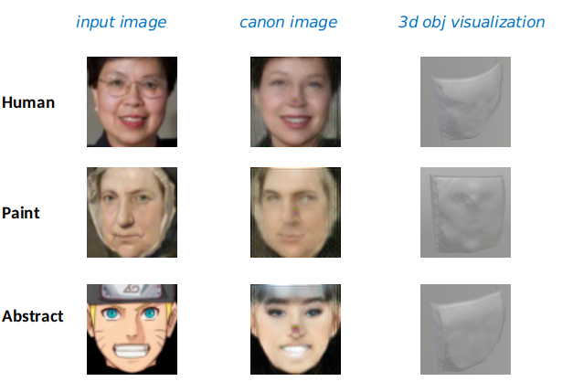

# (WIP)unsup3D_pytorch3d (CVPR2020 Best paper)
#### [Demo](http://www.robots.ox.ac.uk/~vgg/blog/unsupervised-learning-of-probably-symmetric-deformable-3d-objects-from-images-in-the-wild.html) | [Project Page](https://elliottwu.com/projects/unsup3d/) | [Video](https://www.youtube.com/watch?v=5rPJyrU-WE4) | [Paper](https://arxiv.org/abs/1911.11130)
[Shangzhe Wu](https://elliottwu.com/), [Christian Rupprecht](https://chrirupp.github.io/), [Andrea Vedaldi](http://www.robots.ox.ac.uk/~vedaldi/), Visual Geometry Group, University of Oxford. In CVPR 2020 (Best Paper Award).


We propose a method to learn weakly symmetric deformable 3D object categories from raw single-view images, without ground-truth 3D, multiple views, 2D/3D keypoints, prior shape models or any other supervision.

## 〇 Notice

> author: samuel ko

This repo is target to replace the [neural_renderer](https://github.com/hiroharu-kato/neural_renderer) from CVPR 2018 with the sota renderer ICCV 2019 [Soft Rasterizer](https://github.com/ShichenLiu/SoftRas) provided by pytorch3d.
In order to compatible with the pytorch3d API, we change a little bit in `unsup3d/renderer/renderer.py` & `unsup3d/renderer/utils.py`. 

However, the effect of this implemention is not good. I will still work on this and try to fix that problem.

**SoftRas**(trained on celebA)






## ① Setup (with [Anaconda](https://www.anaconda.com/))

### 1. Install dependencies:
```
conda env create -f environment.yml
```
OR manually:
```
conda install -c conda-forge scikit-image matplotlib opencv moviepy pyyaml tensorboardX
```

### 2. Install [PyTorch](https://pytorch.org/):
```
conda install pytorch==1.4.0 torchvision cudatoolkit=10.0 -c pytorch
```
*Note*: The code is tested with PyTorch 1.4.0 and CUDA 10.0 on Ubuntu 18.04. A GPU version is required for training and testing, since the [neural_renderer](https://github.com/daniilidis-group/neural_renderer) package only has GPU implementation.

### 3. Install [pytorch3d](https://github.com/facebookresearch/pytorch3d) instead of original repo [neural_renderer](https://github.com/daniilidis-group/neural_renderer)

```
conda install --channel https://conda.anaconda.org/pytorch3d pytorch3d
```

### 4. (For demo only) Install [facenet-pytorch](https://github.com/timesler/facenet-pytorch):
This package is optional for the demo. It allows automatic human face detection.
```
pip install facenet-pytorch
```

## ② Datasets
1. [CelebA](http://mmlab.ie.cuhk.edu.hk/projects/CelebA.html) face dataset. Please download the original images (`img_celeba.7z`) from their [website](http://mmlab.ie.cuhk.edu.hk/projects/CelebA.html) and run `celeba_crop.py` in `data/` to crop the images.
2. Synthetic face dataset generated using [Basel Face Model](https://faces.dmi.unibas.ch/bfm/). This can be downloaded using the script `download_synface.sh` provided in `data/`.
3. Cat face dataset composed of [Cat Head Dataset](http://academictorrents.com/details/c501571c29d16d7f41d159d699d0e7fb37092cbd) and [Oxford-IIIT Pet Dataset](http://www.robots.ox.ac.uk/~vgg/data/pets/) ([license](https://creativecommons.org/licenses/by-sa/4.0/)). This can be downloaded using the script `download_cat.sh` provided in `data/`.

Please remember to cite the corresponding papers if you use these datasets.

## ③ Demo
```
python -m demo.demo --input demo/images/human_face --result demo/results/human_face --checkpoint pretrained/pretrained_celeba/checkpoint030.pth
```

## ④ Training and Testing
Check the configuration files in `experiments/` and run experiments, eg:
```
python run.py --config experiments/train_gdh.yml --gpu 0 --num_workers 2
```

## ⑤ Citation
```
@InProceedings{Wu_2020_CVPR,
  author = {Shangzhe Wu and Christian Rupprecht and Andrea Vedaldi},
  title = {Unsupervised Learning of Probably Symmetric Deformable 3D Objects from Images in the Wild},
  booktitle = {CVPR},
  year = {2020}
}
```
